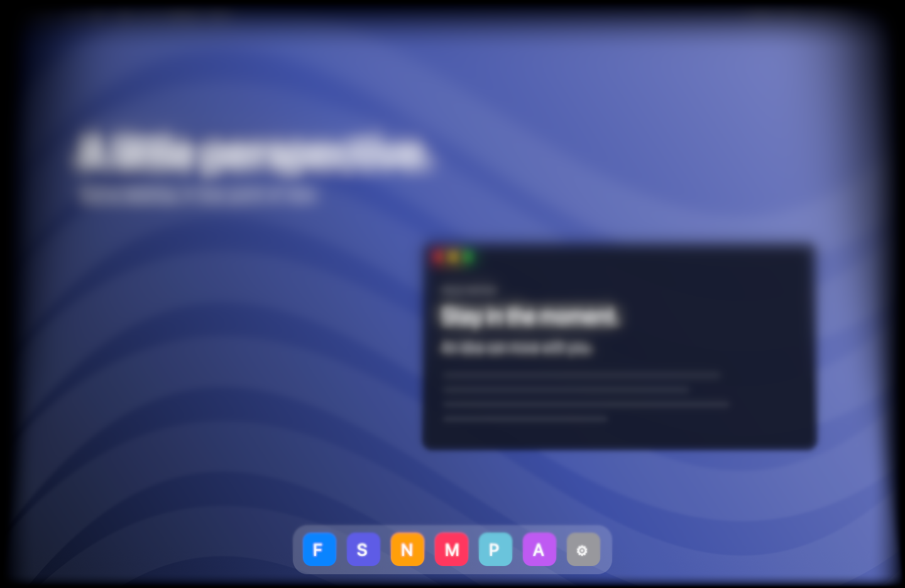

# Mac Duo

A native macOS menu bar app that turns closing your MacBook into a soft, cinematic fade.

[Website & interactive preview](https://norvancc.github.io/mac-duo/) · [Download](https://github.com/norvancc/mac-duo/releases/latest) · [简体中文](README.zh-CN.md) · [MIT License](LICENSE)

Mac Duo captures your built-in display once, keeps the screenshot in place, and gradually closes a feathered trapezoid mask over it as you lower the lid. A vertical gradient of Gaussian blur adds a Lomo-style vignette. Text, windows, and icons retain their original coordinates and proportions.



*The preview uses a generated sample desktop, not a real screen capture.*

## Features

- Follows the actual lid angle on compatible MacBooks.
- Keeps the screenshot stationary while the mask changes shape; its bottom corners stay anchored to the hinge.
- Combines soft mask edges, progressive blur, and a smooth fade at the physical display boundary.
- Includes a five-second full-screen demo, a sample preview, and an optional mask grid.
- Offers controls for the trigger angle, mask shape, and blur strength.
- Captures one frame per transition, keeps it in memory, and releases it when the effect ends. No audio capture, analytics, or network requests.
- Dismisses the overlay when the lid reopens, the system sleeps, the display configuration changes, or the sensor becomes unavailable.

The current settings UI is in Simplified Chinese.

## Requirements

- macOS 14 or later and a Metal-capable Mac.
- A MacBook exposing the supported lid-angle HID sensor for automatic triggering. Verified on Mac16,8 running macOS 15.7.9; other models may differ.

The windowed sample preview works without screen-recording permission. Full-screen capture requires macOS Screen Recording permission and an active built-in display. The full-screen demo does not require a lid sensor.

## Download and install

[Download Mac Duo 1.0.6 (DMG)](https://github.com/norvancc/mac-duo/releases/download/v1.0.6/Mac-Duo-1.0.6-universal.dmg). Open the disk image and drag **Mac Duo** to **Applications**.

The universal app includes Apple Silicon and Intel binaries, is signed with Developer ID, and is notarized by Apple. Architecture support does not guarantee a compatible lid sensor. A ZIP archive and SHA-256 checksums are available on the [release page](https://github.com/norvancc/mac-duo/releases/tag/v1.0.6).

## Build and run

Building from source requires Xcode with a macOS SDK and Swift 5.9 or later (tested with Swift 6.2). The local packaging script requires your own **Apple Development** signing identity. No certificates or private keys are included.

```sh
git clone https://github.com/norvancc/mac-duo.git
cd mac-duo
bash scripts/build-app.sh
open 'build/Mac Duo.app'
```

The packaging script selects an available Apple Development identity. To consistently use a particular identity:

```sh
MAC_DUO_SIGNING_IDENTITY='Apple Development: Your Name (TEAMID)' bash scripts/build-app.sh
```

Keep the same signing identity and app location across rebuilds so macOS can recognize the existing recording grant. Wait for the build and signature verification to finish before opening the app. These are local development builds, not notarized distribution packages.

Without a signing identity, you can still build the executable and run the tests and synthetic render checks:

```sh
swift build -c release
swift test
.build/release/MacDuo --render-check
```

## Use

1. Open Mac Duo and allow it in **System Settings → Privacy & Security → Screen Recording** when prompted. The permission name varies by macOS version.
2. Leave **启用合盖效果** enabled. With default settings, first open the lid past **112°**, then lower it below **110°** to start the effect.
3. Use **全屏试播** for a five-second demo without moving the lid.
4. Press **Control + Option + Command + D** to stop the effect. Escape also works while the settings window is active.

Closing the settings window leaves the menu bar app running. The app does not add a login item or prevent the Mac's normal sleep behavior. After wake, the desktop appears normally; the next closing gesture captures a fresh frame.

If macOS shows permission enabled but capture fails, use **重新检查权限** to verify access through ScreenCaptureKit, then **重启** if necessary. Switching from a temporary signature to a different signing identity may require refreshing the app's permission entry once.

## How it works

1. **Sense:** IOKit reads the hinge sensor on a dedicated queue at 60 Hz. The supported HID reports whole-degree angles.
2. **Capture:** ScreenCaptureKit captures one frame of the built-in display, up to 2400 pixels wide, when the lid crosses the configured threshold downward.
3. **Blur:** Core Image applies `CIMaskedVariableBlur` to the stationary screenshot, with stronger blur toward the top.
4. **Mask:** Angle geometry shapes a white mask with `CIPerspectiveTransform`. This transform only affects the mask. Its feathered silhouette controls how much of the original screenshot remains visible against opaque black.
5. **Present:** A Metal view renders in a borderless, mouse-through overlay. Reopening reverses the transition; cleanup releases the screenshot.

The lid sensor interface is not an Apple-guaranteed public hinge-angle API. This project is an independent visual experiment and is not affiliated with Apple. It does not attempt to geometrically correct the screenshot for the viewer's position.

The image is a snapshot: apps underneath continue running, and DRM-protected content may be unavailable. A stationary half-closed lid dismisses the effect after 12 seconds. The effect cannot continue once macOS turns off the display or sleeps.

## Development

```sh
swift test
swift run -c release MacDuo --render-check
swift run -c release MacDuo --render-check --benchmark
```

Core tests cover angle geometry, fixed hinge endpoints, numerical stability, and trigger state transitions. Render checks verify stationary screenshot pixels across six mask states, soft mask edges, opaque black output, and smooth display-boundary fading. Generated PNGs are written to `build/render-check/`.

| Directory | Purpose |
| --- | --- |
| `Sources/DuoCore` | Mask geometry and lid-trigger state machine |
| `Sources/MacDuo` | AppKit/SwiftUI UI, HID sensing, capture, and Metal/Core Image rendering |
| `Tests/DuoCoreTests` | Hardware-independent unit tests |
| `Resources` | App bundle metadata |
| `scripts` | Local packaging and icon generation |

There are no third-party package dependencies. See [CONTRIBUTING.md](CONTRIBUTING.md) for development notes.

### Distribution and website

To create universal DMG and ZIP packages, use your own Developer ID Application identity and a `notarytool` keychain profile:

```sh
MAC_DUO_NOTARY_PROFILE='your-notary-profile' bash scripts/build-release.sh
```

Optionally set `MAC_DUO_RELEASE_SIGNING_IDENTITY` to a specific certificate name or SHA-1. The script builds into `build/distribution/<version>/`, signs with the hardened runtime, notarizes and staples the app and DMG, verifies Gatekeeper acceptance, and writes `SHA256SUMS.txt`. It does not overwrite the local development app.

The static website lives in `docs/` and is served by GitHub Pages from `main`. To preview it locally:

```sh
python3 -m http.server 8765 --directory docs
```

Open `http://localhost:8765`. The interactive demo interpolates seven synthetic render-check frames; it does not access the browser's screen or sensors.

## References

- [Apple ScreenCaptureKit screenshot API](https://developer.apple.com/documentation/screencapturekit/scscreenshotmanager)
- [Apple CIPerspectiveTransform](https://developer.apple.com/documentation/coreimage/ciperspectivetransform)
- [Apple CIMaskedVariableBlur](https://developer.apple.com/documentation/coreimage/cimaskedvariableblur)
- [LidAngle: published hinge HID interface information](https://github.com/deepakness/LidAngle)
- [Apple discussion of development signatures and screen-capture permissions](https://developer.apple.com/forums/thread/819406)

## License

[MIT](LICENSE) © 2026 norvancc.
